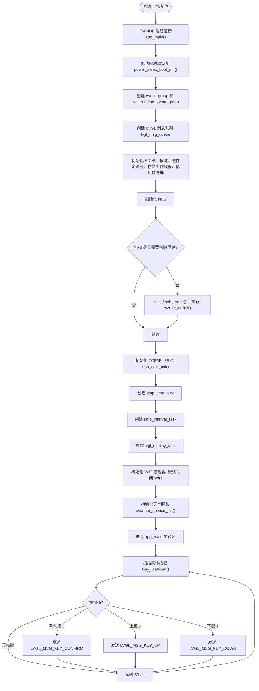
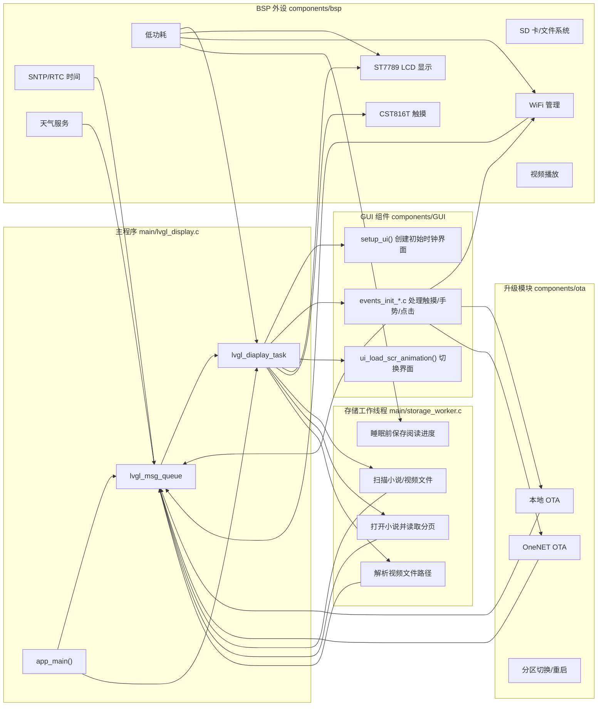
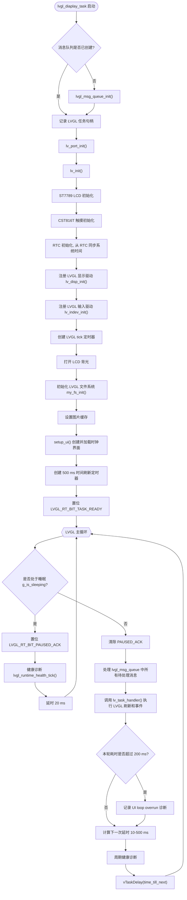
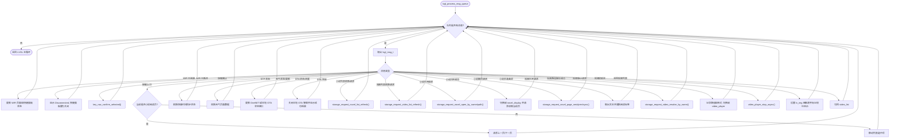
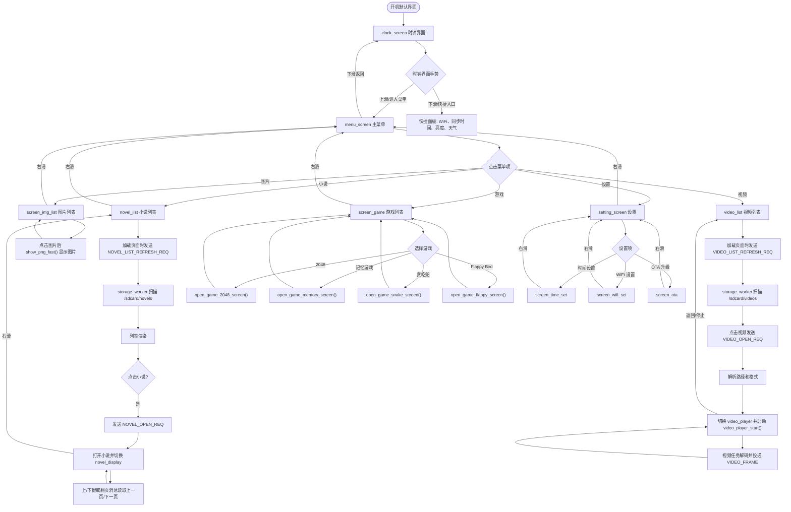
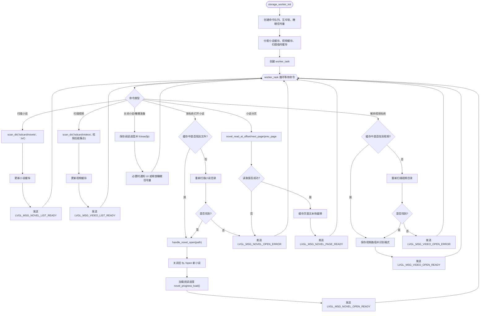
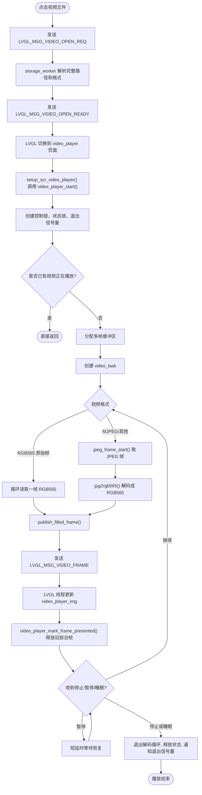
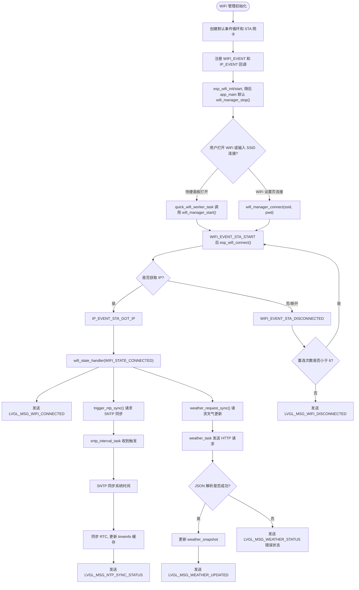
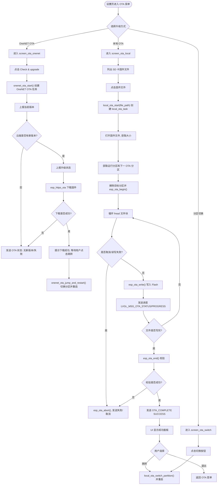
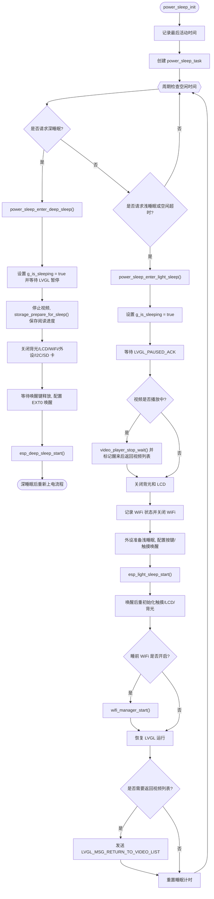

# ESP32 LVGL 智能触控终端程序流程图

本文档根据当前工程源码整理，重点覆盖 `main`、`components/bsp`、`components/GUI`、`components/ota` 中的业务逻辑。`components/lvgl` 属于 LVGL 第三方图形库源码，流程图中只把它作为图形框架调用，不展开其内部实现。

## 1. 程序总体流程

## 2. 任务与模块关系

## 3. LVGL 显示任务流程

## 4. LVGL 消息队列处理流程

## 5. 界面导航主流程

## 6. 存储工作线程流程

## 7. 视频播放流程

## 8. WiFi、时间和天气流程

## 9. OTA 升级流程

## 10. 低功耗流程

## 11. 关键源码对应关系

| 功能 | 主要源码 |
|---|---|
| 程序入口、任务创建、LVGL 消息处理 | `main/lvgl_display.c` |
| LVGL 显示/触摸移植 | `main/lv_port.c` |
| 小说/视频扫描和文件异步处理 | `main/storage_worker.c` |
| UI 页面创建 | `components/GUI/generated/setup_scr_*.c` |
| UI 触摸、手势、按钮事件 | `components/GUI/generated/events_init*.c` |
| LCD 驱动 | `components/bsp/st7789_driver.c` |
| 触摸驱动 | `components/bsp/cst816t_driver.c` |
| SD 卡与小说分页 | `components/bsp/SD_card.c` |
| WiFi 状态管理 | `components/bsp/wifi_manager.c` |
| SNTP/RTC 时间 | `components/bsp/ntp_time.c`, `components/bsp/rtc_time_service.c`, `components/bsp/sd3078.c` |
| 天气请求 | `components/bsp/get_weather.c` |
| 视频播放/解码 | `components/bsp/video_player.c`, `components/bsp/mjpeg_frame.c` |
| 低功耗 | `components/bsp/power_sleep.c`, `components/bsp/peripheral_sleep.c` |
| 本地 OTA | `components/ota/local_ota.c` |
| OneNET OTA | `components/ota/onenet_ota.c`, `components/ota/onenet_mqtt.c`, `components/ota/onenet_dm.c` |

